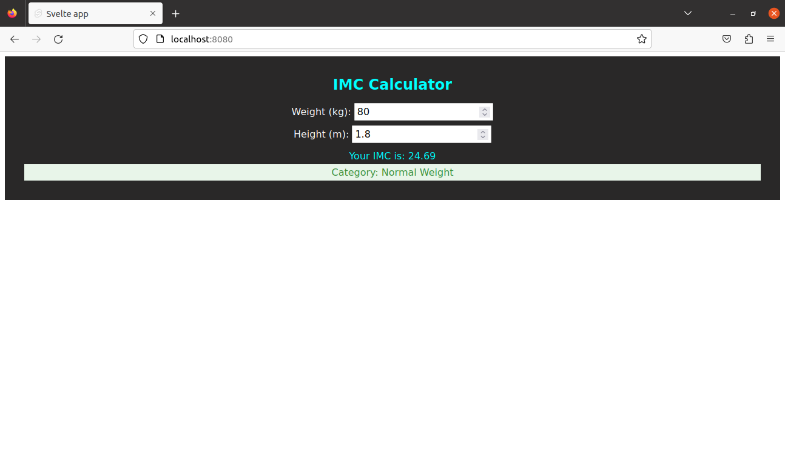

# **Class 3 - Introduction to Svelte**

This WEB application is an IMC Calculator that allows the user to enter with the following information: 

*   Weight (in Kg);
*   Height (in m);

The user's inputs are processed, giving two feedbacks to him.

*   IMC value;
*   IMC category based on the table below:

| IMC           | Category          |
| ------------- | ----------------------- |
| Below 18.5    | Underweight             |
| 18.6 - 24.9   | Normal Weight           |
| 25.0 - 29.9   | Overweight              |
| 30.0 - 34.9   | Obesity Class I         |
| 35.0 - 39.9   | Obesity Class II        |
| 40.0 or more  | Obesity Class III       |

The message related to the category is displayed with text and background in a personalized way. The image below shows how is the application:



## **Pre-requirements**
---
*   Node (used v18.17.1)
*   Npm (used v9.6.7)

## **Run**
---
In order to **run** the project, use the command below:

```shell
npm i
npm run dev
```

If you do not have **node** installed, install it! You can use (**for Linux environment**):

```shell
sudo apt update
sudo apt install nodejs
```
The **npm** already comes with **node**.

**In this project, it was used a newer version of node. Maybe, it can not work with the version present in apt repository**