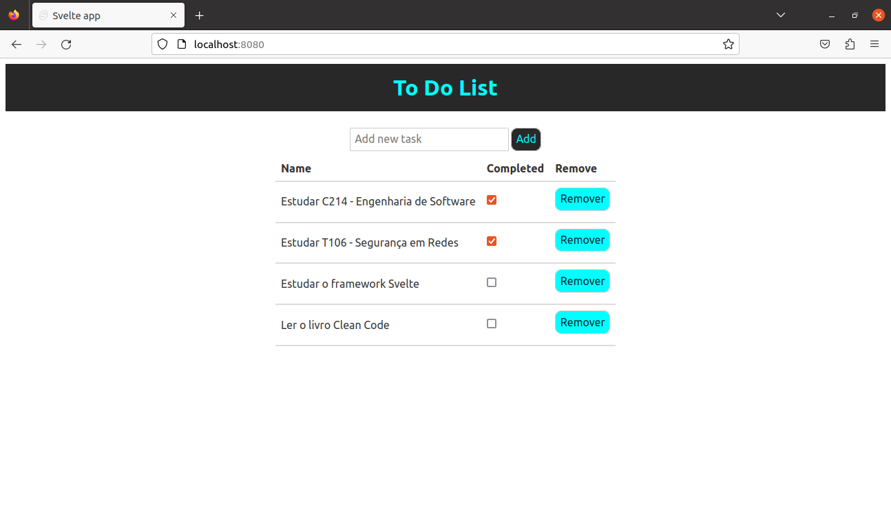

# **To-Do-List Web Application**

This WEB application is a To-Do web app that allows the user to create taks, mark as completed and delete the task. Each task has the following attributes:

*   Id: Generated by an external module called **uuid** that is present in **package.json**;
*   Name;
*   Completed;

The user's inputs are processed and registered into a table with these three informations.

The image below shows how is the application:



## **Pre-requirements**
---
*   Node (used v18.17.1)
*   Npm (used v9.6.7)

## **Run**
---
In order to **run** the project, use the command below:

```shell
npm i
npm run dev
```

If you do not have **node** installed, install it! You can use (**for Linux environment**):

```shell
sudo apt update
sudo apt install nodejs
```
The **npm** already comes with **node**.

**In this project, it was used a newer version of node. Maybe, it can not work with the version present in apt repository**